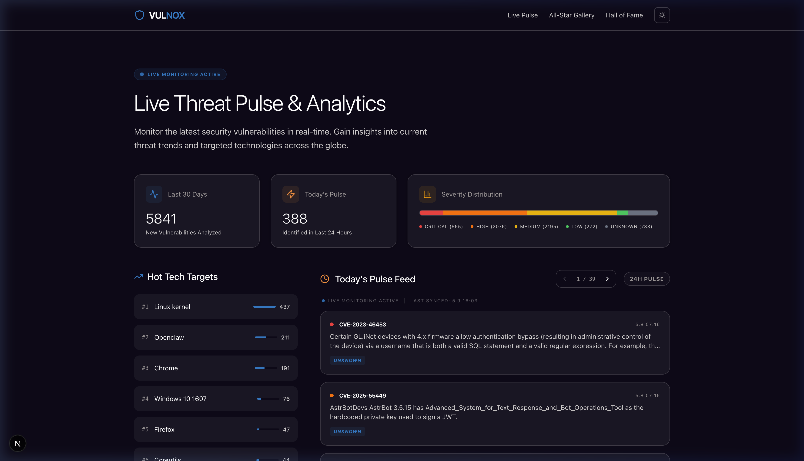
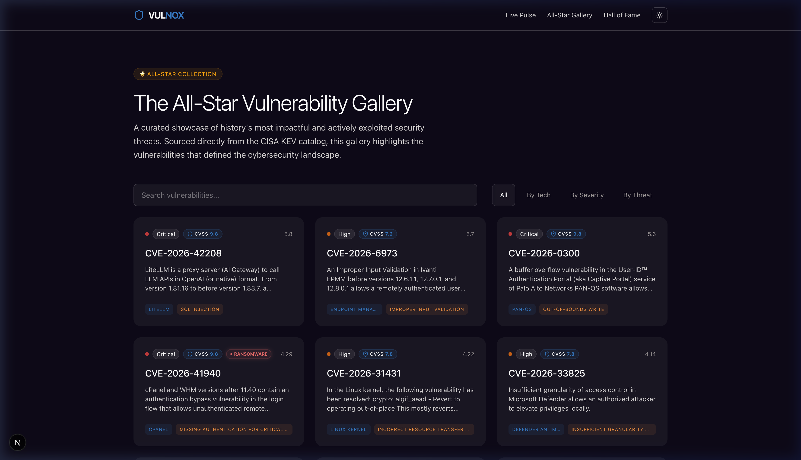
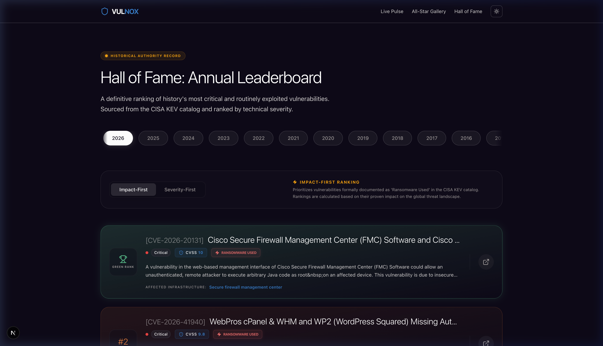
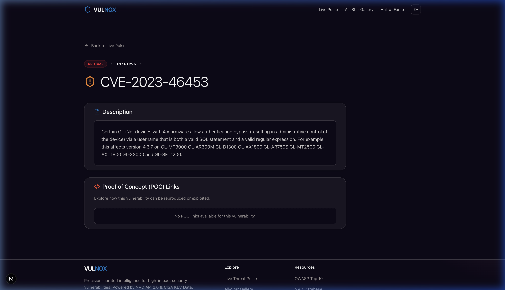

# VULNOX (벌녹스)

> **Precision Threat Intelligence. Selected for Impact.**
>
> VULNOX는 전 세계에서 발생하는 보안 취약점(CVE) 정보를 실시간으로 추적하고, 그 중 가장 치명적이고 실질적인 위협만을 엄선하여 시각화하는 프리미엄 보안 인텔리전스 대시보드입니다.

---

## 💎 프로젝트 개요 (Overview)

VULNOX는 정보의 홍수 속에서 보안 전문가와 개발자가 **가장 시급하게 대응해야 할 취약점**을 즉각적으로 식별할 수 있도록 돕습니다. NVD API 2.0과 CISA KEV 데이터를 결합하여 단순한 데이터 나열을 넘어선 심층적인 통찰력을 제공합니다.

## 🚀 핵심 기능 (Core Features)

### 1. Live Threat Pulse (실시간 위협 피드)

*   **실시간 모니터링:** 2시간마다 자동으로 업데이트되는 최신 CVE 피드를 제공합니다.
*   **Trend Analytics:** 최근 30일간의 데이터를 분석하여 현재 어떤 기술(Hot Tech Targets)이 집중적으로 공격받고 있는지 시각화합니다.
*   **Severity Distribution:** 심각도별 분포를 통해 현재 보안 생태계의 위험 수준을 한눈에 파악합니다.

### 2. All-Star Vulnerability Gallery (엄선된 취약점 갤러리)

*   **CISA KEV 기반:** 단순히 점수가 높은 취약점이 아닌, 실제로 공격에 악용된 증거가 있는(Known Exploited Vulnerabilities) 취약점들만 큐레이션합니다.
*   **풍부한 메타데이터:** 랜섬웨어 사용 여부, CVSS 상세 점수 배지 등 전문적인 보안 정보를 제공합니다.

### 3. Hall of Fame (명예의 전당 - 리더보드)

*   **연도별 영향력 랭킹:** 2010년부터 현재까지, 매년 보안 생태계에 가장 큰 파장을 일으켰던 TOP 10 취약점을 랭킹화합니다.
*   **Scoring Algorithm:** CVSS 점수(50%) + 실제 악용 사례(30%) + 기술적 관심도 및 POC(20%)를 결합한 독자적인 영향력 지수를 적용합니다.

### 4. Technical Insight View (상세 분석)

*   **CPE/CWE 매핑:** 영향을 받는 기술군과 위협 유형을 자동으로 분류하여 보여줍니다.
*   **POC 통합:** 취약점 분석 및 대응을 위한 Proof of Concept 외부 링크를 통합 제공합니다.

## 🎨 디자인 철학 (Design Philosophy)

*   **Premium Dark Aesthetics:** 깊이 있는 다크 모드를 기본으로, Glassmorphism과 미세한 Glow 효과를 통해 현대적이고 고급스러운 인터페이스를 제공합니다.
*   **Minimalist Data UX:** 정보 과부하를 줄이기 위해 날짜 형식을 간결화(`M.D`)하고, 중요한 지표에 시각적 위계를 부여합니다.

## 🛠 기술 스택 (Tech Stack)

*   **Frontend:** Next.js 15 (App Router), TypeScript, Tailwind CSS v4
*   **Animations:** Framer Motion, Lucide React
*   **Data Pipeline:** GitHub Actions (2시간 주기 자동 업데이트)
*   **Deployment:** Static Export 기반 서버리스 아키텍처

## 🏃 시작하기 (Quick Start)

```bash
# 의존성 설치
npm install

# 개발 서버 실행
npm run dev
```

서버 실행 후 [http://localhost:3000](http://localhost:3000)에서 대시보드를 확인할 수 있습니다.

## 📂 문서 (Documentation)

*   [PRD (제품 요구 사양서)](./docs/PRD.md)
*   [디자인 가이드라인](./docs/DESIGN.md)
*   [로드맵 및 작업 현황](./docs/Tasks.md)

---
© 2026 VULNOX Intelligence. All rights reserved.
